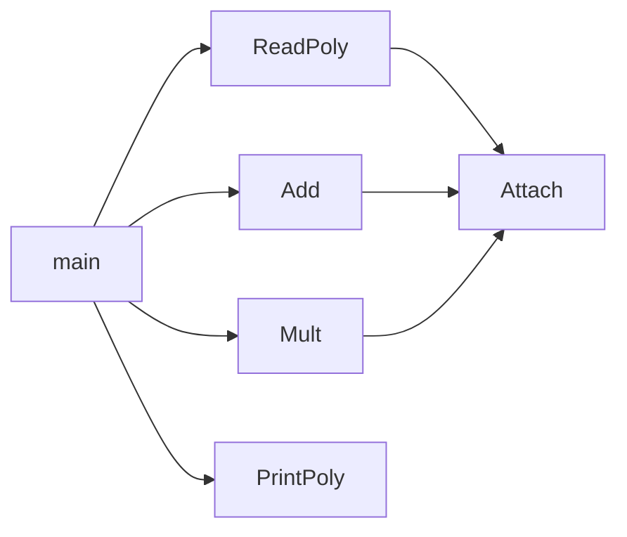

## 1 实验题目

多项式乘法问题

## 2 实验目的

设计一个一元稀疏多项式简单计算器。

## 3 实验内容与要求

一元稀疏多项式简单计算器的基本功能是：

（1）输入并建立多项式；

（2）输出多项式，输出形式为整数序列：$n$, $c_1$, $e_1$, $c_2$, $e_2$, ..., $c_n$, $e_n$，其中 $n$ 是多项式的项数，$c_i$ 和 $e_i$ 分别是第 $i$ 项的系数和指数，序列按指数降序排列。  

（3）多项式 $a$ 与多项式 $b$ 相乘，建立多项式。

## 4 实验内容和实验步骤

### 4.1 需求分析

陈述程序设计的任务，强调程序要做什么，明确规定： 

1. 输入的形式和输入值的范围；

2. 输出的形式；

3. 程序所能实现的功能；

（答案略）

### 4.2 概要设计

数据结构定义

```c
typedef struct PolyNode* Polynomial;
struct PolyNode {
    int coef;	// 底数
    int expon;	// 指数
    Polynomial link;
};
```

主程序流程

```c
int main() {
    Polynomial P1, P2, PP, PS;
    // 读链表
    P1 = ReadPoly();
    P2 = ReadPoly();
    // 链表乘法
    PP = Mult(P1, P2);
	// 打印链表
    PrintPoly(PP);
    // 链表加法
    PS = Add(P1, P2);
    // 打印链表
    PrintPoly(PS);
    return 0;
}
```

各程序模块之间的调用关系



### 4.3 详细设计

Attach，在指定位置添加一个新的结点，并将指针指向新的位置

```c
void Attach(int c, int e, Polynomial* pRear) {
    // 申请一个新结点
    Polynomial P;
    P = (Polynomial)malloc(sizeof(struct PolyNode));
    P->coef = c;
    P->expon = e;
    P->link = NULL;
    // 将结点添加到 pRear
    (*pRear)->link = P;
    // 传地址的原因
    *pRear = P;
}
```

ReadPoly，从 stdin 中读入数据，生成链表并返回

```c
Polynomial ReadPoly() {
    int c, e, n;
    // 定义一个含头结点链表
    Polynomial P;
    P = (Polynomial)malloc(sizeof(struct PolyNode));
    P->link = NULL;
    Polynomial Rear = P;
    // 读入数据并尾插
    scanf("%d", &n);
    while (n--) {
        scanf("%d %d", &c, &e);
        Attach(c, e, &Rear);
    }
    // 删除头结点
    Rear = P;
    P = P->link;
    free(Rear);
    return P;
}
```

PrintPoly，打印链表

```c
void PrintPoly(Polynomial P) {
    int flag = 0;
    if (P == NULL) {
        printf("0 0\n");
        return;
    }
    while (P != NULL) {
        if (flag == 0) {
            flag = 1;
        } else {
            printf(" ");
        }
        printf("%d %d", P->coef, P->expon);
        P = P->link;
    }
    printf("\n");
}
```

Add，链表相加

```c
Polynomial Add(Polynomial P1, Polynomial P2) {
    // 定义含头结点链表
    Polynomial P;
    P = (Polynomial)malloc(sizeof(struct PolyNode));
    P->link = NULL;
    // 指向链表的指针
    Polynomial Rear = P, t1 = P1, t2 = P2;
    // 链表相加
    while (t1 != NULL && t2 != NULL) {
        if (t1->expon == t2->expon) {
            if (t1->coef + t2->coef != 0)
                Attach(t1->coef + t2->coef, t1->expon, &Rear);
            t1 = t1->link;
            t2 = t2->link;
        } else if (t1->expon > t2->expon) {
            Attach(t1->coef, t1->expon, &Rear);
            t1 = t1->link;
        } else {
            Attach(t2->coef, t2->expon, &Rear);
            t2 = t2->link;
        }
    }
    // 剩余部分遍历尾插
    while (t1 != NULL) {
        Attach(t1->coef, t1->expon, &Rear);
        t1 = t1->link;
    }
    while (t2 != NULL) {
        Attach(t2->coef, t2->expon, &Rear);
        t2 = t2->link;
    }
    Rear->link = NULL;
    // 删除头结点
    Rear = P;
    P = P->link;
    free(Rear);
    return P;
}
```

Mult，多项式乘法

```c
Polynomial Mult(Polynomial P1, Polynomial P2) {
    if (P1 == NULL || P2 == NULL)
        return NULL;
    // 定义含头结点链表
    Polynomial P;
    P = (Polynomial)malloc(sizeof(struct PolyNode));
    P->link = NULL;
    // 指向链表的指针
    Polynomial Rear, t, t1, t2;
    Rear = P, t1 = P1, t2 = P2;
    // 用 P1 的第一项乘以 P2，构造基础的 P
    while (t2 != NULL) {
        Attach(t1->coef * t2->coef, t1->expon + t2->expon, &Rear);
        t2 = t2->link;
    }
    // P1 剩余项与 P2 相乘并与 P 相加
    t1 = t1->link;
    while (t1 != NULL) {
        t2 = P2;
        Rear = P;
        while (t2 != NULL) {
            int c = t1->coef * t2->coef;
            int e = t1->expon + t2->expon;
            // 定位找到合适的插入点
            while (Rear->link != NULL && Rear->link->expon > e)
                Rear = Rear->link;
            // 插入点
            if (Rear->link != NULL && Rear->link->expon == e) {
                if (Rear->link->coef + c != 0) {
                    Rear->link->coef += c;
                } else {
                    // 删除 0 系数项
                    t = Rear->link;
                    Rear->link = t->link;
                    free(t);
                }
            } else {
                t = (Polynomial)malloc(sizeof(struct PolyNode));
                t->coef = c;
                t->expon = e;
                t->link = Rear->link;
                Rear->link = t;
                Rear = Rear->link;
            }
            t2 = t2->link;
        }
        t1 = t1->link;
    }
    // 删除头结点
    Rear = P;
    P = P->link;
    free(Rear);
    return P;
}
```

### 4.4 调试分析

1. 调试过程中所遇到的问题及解决方法

   （答案略）

2. 算法的时空分析

   Attach()：$O(1)$

   ReadPoly()：$O(n)$

   PrintPoly()：$O(n)$

   Add()：$O(n)$

   Mult()： $O(n^2)$

## 5 实验用测试数据和相关结果分析

### 5.1 实验结果

列出对于给定的输入所产生的输出结果。若可能，测试随输入规模的增长所用算法的实际运行时间的变化

（略）

### 5.2 实验总结

有关实验过程中的感悟和体会、经验和教训等

（略）

