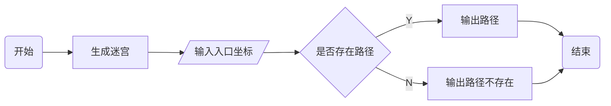
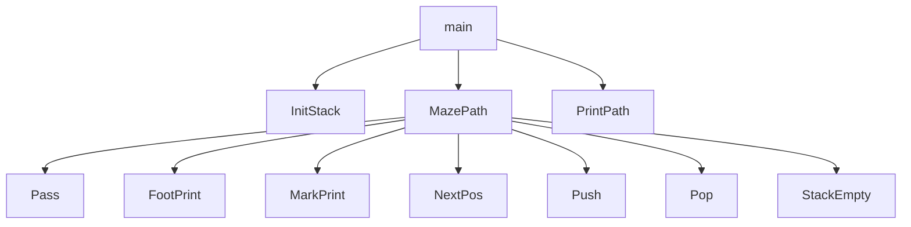

## 1 实验题目

迷宫的求解

## 2 实验内容与要求

迷宫只有两个门，一个叫做入口，另一个叫做出口。把一只老鼠从一个无顶盖的大盒子的入口处赶进迷宫。迷宫中设置很多隔壁，对前进方向形成了多处障碍，在迷宫的唯一出口处放置了一块奶酪，吸引老鼠在迷宫中寻找通路以到达出口。求解迷宫问题，即找出从入口到出口的路径。

### 2.1 知识要点

迷宫问题是栈应用的一个典型例子。求解过程可采用回溯法。回溯法是一种不断试探且及时纠正错误的搜索方法。从入口出发，按某一方向向前探索，若能走通（未走过的），即某处可以到达，则到达新点，否则试探下一方向 ; 若所有的方向均没有通路，则沿原路返回前一点，换下一个方向再继续试探，直到所有可能的通路都探索到，或找到一条通路，或无路可走又返回到入口点。在求解过程中，为了保证在到达某一点后不能向前继续行走（无路）时，能正确返回前一点以便继续从下一个方向向前试探，则需要用一个栈保存所能够到达的每一点的下标及从该点前进的方向，栈中保存的就是一条迷宫的通路。

为了确保程序能够终止，调整时，必须保证曾被放弃过的填数序列不被再次试验，即要求按某种有序模型生成填数序列。给解的候选者设定一个被检验的顺序，按这个顺序逐一生成候选者并检验。

### 2.2 实现提示

对于迷宫问题，用回溯法的难点就在如何为解空间排序，以确保曾被放弃过的填数序列不被再次试验，在二维迷宫里面，从出发点开始，每个点按四邻域算，按照右、上、左、下的顺序搜索下一落脚点，有路则进，无路即退，前点再从下一个方向搜索，即可构成一有序模型。

## 3 实验内容和实验步骤

### 3.1 需求分析

陈述程序设计的任务，强调程序要做什么，明确规定：

1. 输入的形式和输入值的范围； 

2. 输出的形式； 

3. 程序所能实现的功能；

### 3.2 概要设计

#### 3.2.1 数据结构定义

使用链表实现栈

1. 结点定义

```c
typedef struct Node {
    ElemType data;		// 数据域
    struct Node* next;	// 指针域
} Node;
```

2. 栈定义

```c
typedef Node* Stack;
```

#### 3.2.2 主程序流程



#### 3.2.3 各程序模块之间的调用关系



### 3.3 详细设计

#### 3.3.1 链表实现栈

栈定义 `stack.h` 文件，其中 `#ifndef - #define - #endif` 用于防止头文件重复包含和编译

```c
#ifndef STACK_H_
#define STACK_H_

#include <stdlib.h>
#include <stdbool.h>	// bool, true, false

typedef struct {
    int x;
    int y;
} PosType;

typedef struct {
    int ord;
    PosType seat;
    int di;
} ElemType;

typedef struct Node {
    ElemType data;
    struct Node* next;
} Node;

typedef Node* Stack;

// 栈初始化
void InitStack(Stack* s);
// 判断栈是否为空
bool StackEmpty(Stack s);
// 入栈
void Push(Stack s, Elem e);
// 出栈
bool Pop(Stack s, Elem* e);
// 栈顶元素
bool Top(Stack s, Elem* e);
// 删除栈
void DeleteStack(Stack s);

#endif
```

栈实现 `stack.c` 文件

```cpp
#include "stack.h"

void InitStack(Stack* s) {
    // 初始化一个带头结点的空链表
    *s = (Node*)malloc(sizeof(Node));
    (*s)->next = NULL;
}

bool StackEmpty(Stack s) {
    if (s->next == NULL)
        return true;
    else
        return false;
}

void Push(Stack s, ElemType e) {
    // 申请一个新结点
    // 赋值后头插到链表中
    Node* t = (Node*)malloc(sizeof(Node));
    t->data = e;
    t->next = s->next;
    s->next = t;
}

bool Pop(Stack s, ElemType* top) {
    if (StackEmpty(s))
        return false;
    // 栈不为空时
    // 获取头结点数据域，保存到 top
    // 删除头结点
    Top(s, top);
    Node* t = s->next;
    s->next = t->next;
    free(t);
    return true;
}

bool Top(Stack s, ElemType* top) {
    if (StackEmpty(s))
        return false;
    // 栈不为空时
    // 获取头结点数据，保存到 top 中
    *top = s->next->data;
    return true;
}

void DeleteStack(Stack s) {
	// 遍历并释放结点
    while (s != NULL) {
        Node *t = s;
        s = s->next;
        free(t);
    }
}
```

#### 3.3.2 主程序入口

```c
int main() {
    // 定义并赋值开始和结束坐标
    PosType start, end;
    // 定义并初始化栈
    Stack s;
    InitStack(&s);
    // 如果存在路径，则输出路径
    if (MazePath(s, start, end))
        PrintPath();
    else
        printf("Path not found.");
    // 销毁栈
    DeleteStack(s);
    return 0;
}
```

#### 3.3.3 寻找路径

```c
bool MazePath(Stack s, PosType start, PosType end) {
    // 算法 3.3
}
```

#### 3.3.4 输出路径

##### 1 地图标记法

对于 $m\times n$ 大小的地图，可采用不同的数字标记地图坐标点的类型，如：

- -1：墙

- 0：未经过

- 1-4：路径方向 `int dirs[4][2] = {{1, 0}, {0, 1}, {-1, 0}, {0, -1}};`

```c
#define M 10
#define N 10

int maze[M][N] = {};

void PrintMaze() {
    for (int i = 0; i < M; i++)
        for (int j = 0; j < N; j++) {
            // 根据 maze[i][j] 的值输出对应内容
        }
}
```

##### 2 输出栈法

若栈中保存路径，可以将路径输出

```c
// 递归法逆序输出链表数据域
void PrintStack(Stack s) {
    if (s == NULL)
        return;
    PrintStack(s->next);
    ElemType data = s->data;
    printf("(%d, %d) ", data.seat.x, data.seat.y);
}

// 调用（避开头结点）
PrintStack(s->next);
```

### 3.4 调试分析

1. 调试过程中所遇到的问题及解决方法
2. 算法的时空分析

| 时间复杂度 | 函数名                                                       |
| :--------: | :----------------------------------------------------------- |
|   $O(1)$   | InitStack();<br>StackEmpty();<br>Push();<br>Pop();<br>Top(); |
|   $O(n)$   | DeleteStack();<br>PrintStack();                              |
|  $O(mn)$   | PrintMaze();                                                 |


## 4 实验用测试数据和相关结果分析

### 4.1 实验结果

列出对于给定的输入所产生的输出结果。若可能，测试随输入规模的增长所用算法的实际运行时间的变化

### 4.2 实验总结

有关实验过程中的感悟和体会、经验和教训等