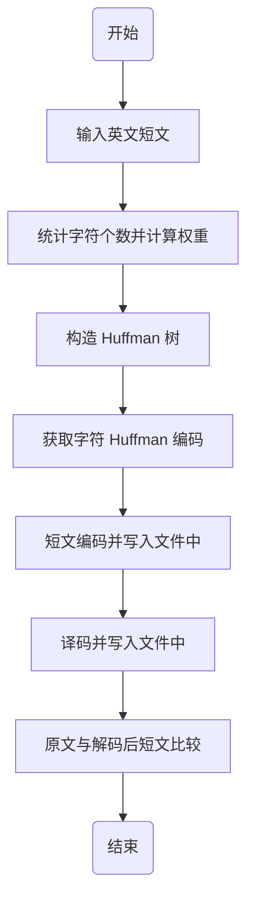
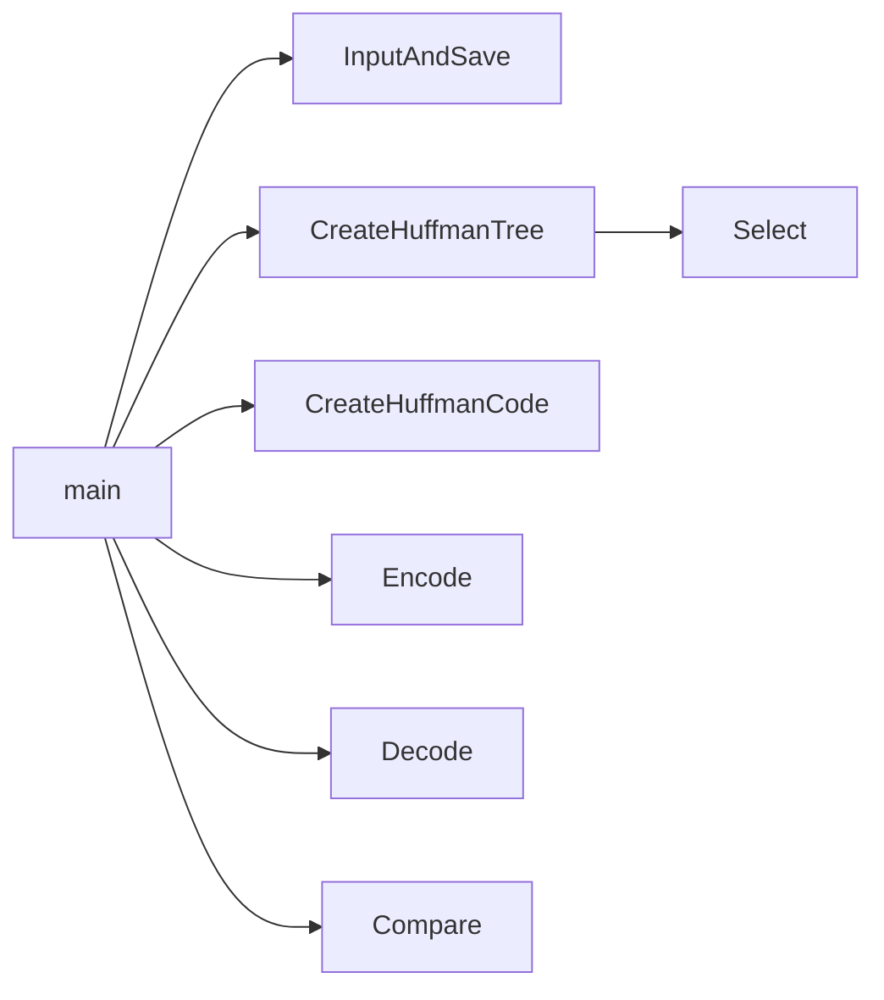

## 1 实验题目

Huffman 树及 Huffman 编码的算法实现

## 2 实验目的

1. 了解该树的应用实例，熟悉掌握 Huffman 树的构造方法及 Huffman 编码的应用，

2. 了解 Huffman 树在通信、编码领域的应用过程。

## 3 实验要求

1. 输入一段100—200字的英文短文，存入一文件 `a` 中。

2. 写函数统计短文出现的字母个数 $n$ 及每个字母的出现次数

3. 写函数以字母出现次数作权值，建 Huffman 树（$n$ 个叶子），给出每个字母的 Huffman 编码。

4. 用每个字母编码对原短文进行编码，码文存入文件 `b` 中。

5. 用 Huffman 树对 `b` 中码文进行译码，结果存入文件 `c` 中，比较 `a`、`c` 是否一致，以检验编码、译码的正确性。

## 4 实验内容和实验步骤

### 4.1 需求分析

陈述程序设计的任务，强调程序要做什么，明确规定： 

1. 输入的形式和输入值的范围； 
2. 输出的形式； 
3. 程序所能实现的功能；

### 4.2 概要设计

#### 4.2.1 数据结构定义

Huffman 树定义

```c
typedef struct {
    // 字符
    char letter;
    // 权重
    unsigned int weight;
    // 父节点、左孩子、右孩子下标
    unsigned int parent, left, right;
} Node, *Tree;
```

Huffman 编码定义

```c
typedef char *Code;
```

#### 4.2.2 主程序流程



#### 4.2.3 各程序模块之间的调用关系



### 4.3 详细设计

#### 4.3.1 主程序入口

```cpp
int main() {
    // 输入英文文章并保存到 a.txt 中
    InputAndSave("a.txt");

    // 构造 Huffman 树
    Tree ht;
    int n;
    CreateHuffmanTree("a.txt", ht, n);

    // 获取 Huffman 编码
    Code hc[128];
    CreateHuffmanCode(hc, ht, n);

    // 短文编码
    Encode("a.txt", "b.txt", hc);

    // 短文解码
    Decode("b.txt", "c.txt", ht, n);

    // 原文与解码后短文比较
    printf("a.txt is %s to c.txt",
           Compare("a.txt", "c.txt") ? "equal" : "not equal");

    // 释放空间
    free(ht);
    return 0;
}
```

#### 4.3.2 文章读入

```cpp
void InputAndSave(const char *filename) {
    // 新建 / 打开文件
    FILE *fp = fopen(filename, "w");
    printf("Please input an essay, end with an enter: ");
    while (true) {
        // 从 stdin 中读取一个字符
        char ch = getchar();
        // 若字符为'\n'，退出循环
        if (ch == '\n')
            break;
        // 写入文件中
        fputc(ch, fp);
    }
    // 关闭文件
    fclose(fp);
}
```

#### 4.3.3 构造 Huffman 树

以 `Hello, World!` 为例

|index|letter|weight|parent|left|right|
|:---:|:---:|:---:|:---:|:---:|:---:|
|1|空格|1|11|0|0|
|2|!|1|11|0|0|
|3|,|1|12|0|0|
|4|H|1|12|0|0|
|5|W|1|13|0|0|
|6|d|1|13|0|0|
|7|e|1|14|0|0|
|8|l|3|17|0|0|
|9|o|2|15|0|0|
|10|r|1|14|0|0|
|11||2|15|2|1|
|12||2|16|4|3|
|13||2|16|6|5|
|14||2|17|10|7|
|15||4|18|11|9|
|16||4|18|13|12|
|17||5|19|14|8|
|18||8|19|16|15|
|19||13|0|17|18|

```c
void CreateHuffmanTree(const char *filename, Tree &ht, int &n) {
    // 从文件中逐个读取字符并计数
    FILE *fp = fopen(filename, "r");
    int count[128] = {0};
    n = 0;
    while (true) {
        char ch = fgetc(fp);
        if (ch == EOF)
            break;
        if (count[ch] == 0)
            n += 1;
        count[ch] += 1;
    }
    fclose(fp);

    // 申请 Huffman 树空间
    ht = (Tree)malloc(2 * n * sizeof(Node));

    // 不使用 0 号单元
    // 将字符及权重存入树中
    // 置 parent, left, right 为 0
    Tree p = ht + 1;
    for (int i = 0; i < 128; i++) {
        if (count[i] != 0) {
            p->letter = i;
            p->weight = count[i];
            p->parent = 0;
            p->left = 0;
            p->right = 0;
            p += 1;
        }
    }

    // 构建 Huffman 树
    for (int i = n + 1; i < 2 * n; i++) {
        // 在 ht[1..i-1] 中选择 parent=0 且 weight 最小的两个结点
        int s1, s2;
        Select(ht, i - 1, s1, s2);

        ht[s1].parent = i;
        ht[s2].parent = i;
        ht[i].letter = ' ';
        ht[i].weight = ht[s1].weight + ht[s2].weight;
        ht[i].parent = 0;
        ht[i].left = s1;
        ht[i].right = s2;
    }
}

void Select(Tree ht, int n, int &s1, int &s2) {
    int w1 = 0x3f3f3f3e, w2 = 0x3f3f3f3f;
    for (int i = 1; i <= n; i++) {
        if (ht[i].parent == 0) {
            if (ht[i].weight <= w1 && ht[i].weight < w2) {
                w2 = w1;
                w1 = ht[i].weight;
                s2 = s1;
                s1 = i;
            }
            if (ht[i].weight > w1 && ht[i].weight < w2) {
                w2 = ht[i].weight;
                s2 = i;
            }
        }
    }
}
```

#### 4.3.4 获取 Huffman 编码

```c
void CreateHuffmanCode(Code hc[], Tree ht, int n) {
    // 编码临时存储空间
    char *cd = (char *)malloc(n * sizeof(char));
    cd[n - 1] = '\0';
    // 从叶子节点逆向求编码
    int start, c, f;
    for (int i = 1; i <= n; i++) {
        // 编码结束位置
        start = n - 1;
        for (c = i, f = ht[i].parent; f != 0; c = f, f = ht[f].parent) {
            if (ht[f].left == c)
                cd[--start] = '0';
            else
                cd[--start] = '1';
        }
        // 将编码存到指定位置
        char letter = ht[i].letter;
        hc[letter] = (char *)malloc((n - start) * sizeof(char));
        strcpy(hc[letter], &cd[start]);
    }
    // 释放临时存储空间
    free(cd);
}
```

#### 4.3.5 短文编码

```c
void Encode(const char *src, const char *dst, Code hc[]) {
    FILE *fsrc = fopen(src, "r");
    FILE *fdst = fopen(dst, "w");

    // 从 src 中读字符
    // 查询编码后写入 dst
    while (true) {
        char ch = fgetc(fsrc);
        if (ch == EOF)
            break;
        fputs(hc[ch], fdst);
    }

    fclose(fsrc);
    fclose(fdst);
}
```

#### 4.3.6 短文解码

```c
void Decode(const char *src, const char *dst, Tree ht, int n) {
    FILE *fsrc = fopen(src, "r");
    FILE *fdst = fopen(dst, "w");

    int i = 2 * n - 1;
    while (true) {
        char ch = fgetc(fsrc);
        if (ch == EOF)
            break;
        // 寻找叶子节点
        if (ch == '0')
            i = ht[i].left;
        else
            i = ht[i].right;
        // 到达叶子节点
        // 将对应字符写入文件
        if (ht[i].left == 0 && ht[i].right == 0) {
            fputc(ht[i].letter, fdst);
            i = 2 * n - 1;
        }
    }

    fclose(fsrc);
    fclose(fdst);
}
```

#### 4.3.7 原文与解码后短文比较

```cpp
bool Compare(const char *first, const char *second) {
    // 打开文件
    FILE *f1 = fopen(first, "r");
    FILE *f2 = fopen(second, "r");

    int res = true;

    // 逐字符比较两个文件
    char c1, c2;
    while (!feof(f1) && !feof(f2)) {
        c1 = fgetc(f1);
        c2 = fgetc(f2);
        // 字符不相同，跳出循环
        if (c1 != c2) {
            res = false;
            break;
        }
    }

    // 两个文件长度不相同
    if (c1 != EOF || c2 != EOF)
        res = false;

    // 关闭文件
    fclose(f1);
    fclose(f2);

    return res;
}
```

### 4.4 调试分析

1. 调试过程中所遇到的问题及解决方法
2. 算法的时空分析

|时间复杂度|函数名|
|:---:|:---|
|$O(n)$|InputAndSave()<br>Select()<br>Encode()<br>Decode()<br>Compare()|
|$O(n^2)$|CreateHuffmanTree()<br>CreateHuffmanCode()|

## 5 实验用测试数据和相关结果分析

### 5.1 实验结果

列出对于给定的输入所产生的输出结果。若可能，测试随输入规模的增长所用算法的实际运行时间的变化。

### 5.2 实验总结

有关实验过程中的感悟和体会、经验和教训等。