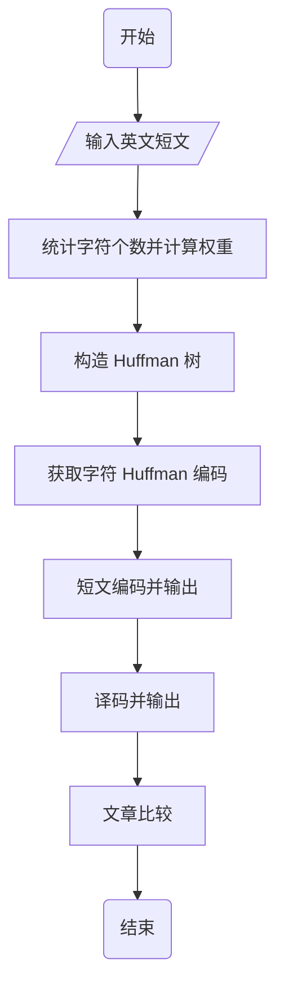
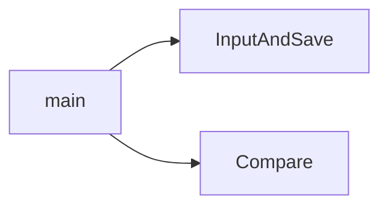

## 1 实验题目

Huffman 树及 Huffman 编码的算法实现

## 2 实验目的

1. 了解该树的应用实例，熟悉掌握 Huffman 树的构造方法及 Huffman 编码的应用，

2. 了解 Huffman 树在通信、编码领域的应用过程。

## 3 实验要求

1. 输入一段100—200字的英文短文，存入一文件 `a` 中。

2. 写函数统计短文出现的字母个数 $n$ 及每个字母的出现次数

3. 写函数以字母出现次数作权值，建 Huffman 树（$n$ 个叶子），给出每个字母的 Huffman 编码。

4. 用每个字母编码对原短文进行编码，码文存入文件 `b` 中。

5. 用 Huffman 树对 `b` 中码文进行译码，结果存入文件 `c` 中，比较 `a`、`c` 是否一致，以检验编码、译码的正确性。

## 4 实验内容和实验步骤

### 4.1 需求分析

陈述程序设计的任务，强调程序要做什么，明确规定： 

1. 输入的形式和输入值的范围； 
2. 输出的形式； 
3. 程序所能实现的功能；

### 4.2 概要设计

#### 4.2.1 数据结构定义

Huffman 树定义

```c
typedef struct {
    unsigned int weight;
    unsigned int parent, left, right;
} Node, *Tree;
```

#### 4.2.2 主程序流程



#### 4.2.3 各程序模块之间的调用关系



### 4.3 详细设计

#### 4.3.1 主程序入口

```cpp

```

#### 4.3.2 文章读入

```cpp
void InputAndSave(const char *filename) {
    // 新建 / 打开文件
    FILE *fp = fopen(filename, "w");
    printf("Please input an essay, end with an enter: ");
    while (true) {
        // 从 stdin 中读取一个字符
        char ch = getchar();
        // 若字符为'\n'，退出循环
        if (ch == '\n')
            break;
        // 写入文件中
        fputc(ch, fp);
    }
    // 关闭文件
    fclose(fp);
}
```

#### 4.3.3 构造 Huffman 树

字符统计，以 `Hello, World!` 为例

|H|e|l|o|,|空格|W|r|d|!|
|:---:|:---:|:---:|:---:|:---:|:---:|:---:|:---:|:---:|:---:|
|1|1|3|2|1|1|1|1|1|1|

Huffman 树构造原则

1. 权值大的结点作为右孩子
2. 权值小的作为左孩子
3. 权值相等，深度小的作为左孩子

```c

```

#### 4.3.4 获取 Huffman 编码

```c

```

#### 4.3.5 短文编码

```c

```

#### 4.3.6 短文解码

```c

```

#### 4.3.7 原文与解码后短文比较

```cpp
bool Compare(const char *first, const char *second) {
    // 打开文件
    FILE *f1 = fopen(first, "r");
    FILE *f2 = fopen(second, "r");

    int res = true;

    // 逐字符比较两个文件
    char c1, c2;
    while (!feof(f1) && !feof(f2)) {
        c1 = fgetc(f1);
        c2 = fgetc(f2);
        // 字符不相同，跳出循环
        if (c1 != c2) {
            res = false;
            break;
        }
    }

    // 两个文件长度不相同
    if (c1 != EOF || c2 != EOF)
        res = false;

    // 关闭文件
    fclose(f1);
    fclose(f2);

    return res;
}
```

### 4.4 调试分析

1. 调试过程中所遇到的问题及解决方法
2. 算法的时空分析

|时间复杂度|函数名|
|:---:|:---|
|$O(1)$||
|$O(n)$|InputAndSave()<br>Compare()|
|$O(n^2)$||

## 5 实验用测试数据和相关结果分析

### 5.1 实验结果

列出对于给定的输入所产生的输出结果。若可能，测试随输入规模的增长所用算法的实际运行时间的变化。

### 5.2 实验总结

有关实验过程中的感悟和体会、经验和教训等。