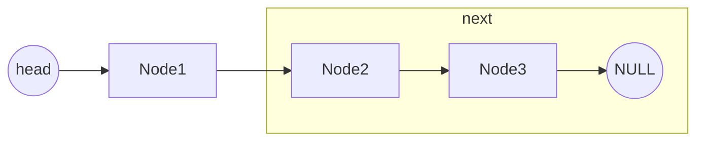
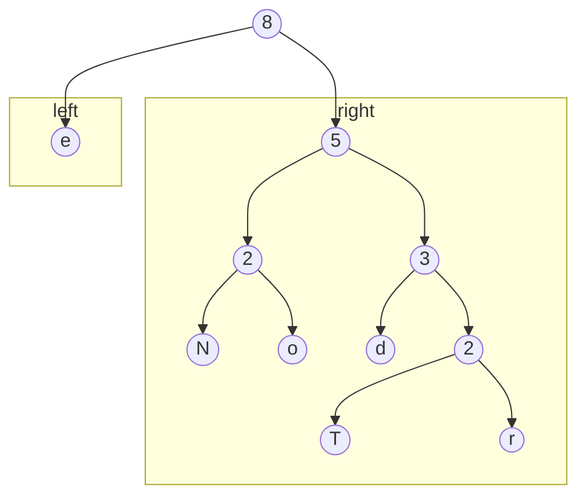

# 链表




```c
typedef struct ListNode {
    int data;
    struct ListNode *next;
} ListNode, *List;
```

### 链表逆序遍历

```c
void traverse() {
    
}
```

# 树




```c
typedef struct TreeNode {
    int data;
    struct TreeNode *left;
    struct TreeNode *right;
} TreeNode, *Tree;
```

### 遍历

```c
void traverse(Tree root) {
    if (root == NULL)
        return;
    do_something(root);
    traverse(root->left);
    traverse(root->right);
}
```

## 二叉树

### 构造二叉树

先序+中序

### 深度

$$
d=1+\max(depth(left),depth(right))
$$

```c
int depth(Tree root) {
    
}
```

### 对称二叉树

### 左右子树互换

## 二叉搜索树

- 所有左子树结点值**均小于**根节点
- 所有右子树结点值**均大于**根节点

### 判断是否为二叉搜索树

### 二叉搜索树后序遍历序列


